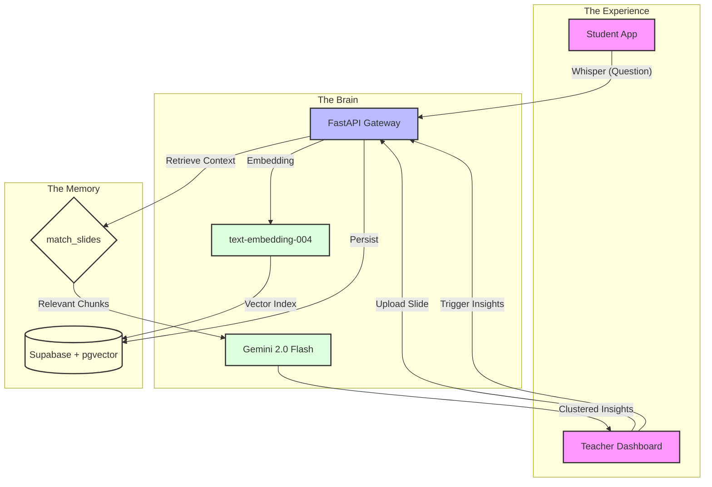

# 🤫 WhisperHunt AI
### *Bridging the Silence in the Classroom with RAG & Gemini 2.0*

[](https://nextjs.org/)
[](https://fastapi.tiangolo.com/)
[](https://deepmind.google/technologies/gemini/)
[-3ECF8E?style=for-the-badge&logo=supabase)](https://supabase.com/)

**WhisperHunt AI** transforms passive classrooms into data-driven learning environments. By leveraging **Retrieval-Augmented Generation (RAG)**, it captures anonymous student feedback, maps it to specific lecture slides via vector search, and delivers high-impact "Insight Clusters" to teachers in real-time.

---

## ✨ Core Pillars

| 🛡️ Radical Anonymity | 🧠 Semantic Intelligence | ⚡ Real-Time Pulse |
| :--- | :--- | :--- |
| Students speak freely without the fear of judgment. | AI doesn't just list questions; it understands *why* they are confused. | Live dashboards that update every 5 seconds to catch confusion as it happens. |

---

## 🏗️ Technical Architecture

The engine behind WhisperHunt combines **Semantic Search** with **Generative Refinement**.



---

## 📽️ Experience Walkthrough

### 🎓 Phase 1: Student Whisper (`/student`)
*Minimalist, mobile-first interface designed for zero friction.*

> [!TIP]
> **Slide 1: Low-Barrier Engagement**
> - **One-Tap Confusion:** Use the 🥺 button for instant signaling.
> - **Animated Feedback:** Tactile UI responses and "Sent to Teacher" (ส่งให้ครูแล้วจ้า 🚀) toasts.
> - **Dark/Light Harmony:** Designed to look great on any device under classroom lighting.

---

### 🧑‍🏫 Phase 2: Teacher Intelligence (`/teacher`)
*Mission-control for educators with automated slide-to-question mapping.*

> [!IMPORTANT]
> **Slide 2: Knowledge Injection (PDF RAG)**
> - **Smart Upload:** Drag your lecture PDF. The system automatically performs OCR and vectorizes content page-by-page.
> - **Glassmorphism UI:** Modern, translucent sidebar and cards for a premium desktop feel.

> [!NOTE]
> **Slide 3: Insight Clustering**
> - **Priority Heatmap:** Cards change from Sky 🔵 to Amber 🟡 to Fire 🔴 based on student count.
> - **Bridge the Gap:** AI identifies exactly which slide corresponds to the confusion and suggests a specific re-explanation strategy.

---

## 🛠️ Tech Stack Evolution

*   **Frontend Ecosystem:** Next.js 15 (App Router), React 19 (Concurrent Mode), Tailwind CSS 4 (Zero-runtime), Lucide Icons.
*   **AI Pipeline:** 
    *   `Gemini 2.0 Flash`: High-speed semantic clustering & reasoning.
    *   `text-embedding-004`: Professional-grade 768d vector embeddings.
*   **Data Layer:** PostgreSQL on Supabase, `pgvector` for similarity calculations, and SQL RPC for high-performance RAG retrieval.

---

## 🚀 Deployment & Local Setup

### 1. Environment Variables
Add these to `backend/.env`:
```bash
GOOGLE_API_KEY=your_key
SUPABASE_URL=your_url
SUPABASE_KEY=your_key
```

### 2. Database Sync
Apply the `setupdata.sql` in Supabase to enable the `vector` extension and the custom `match_slides` function.

### 3. Ignition
```bash
# Terminal 1: Backend
cd backend && uvicorn ai:app --reload

# Terminal 2: Frontend
npm install && npm run dev
```

---
*Developed with a focus on Pedagogy and AI Excellence.*
