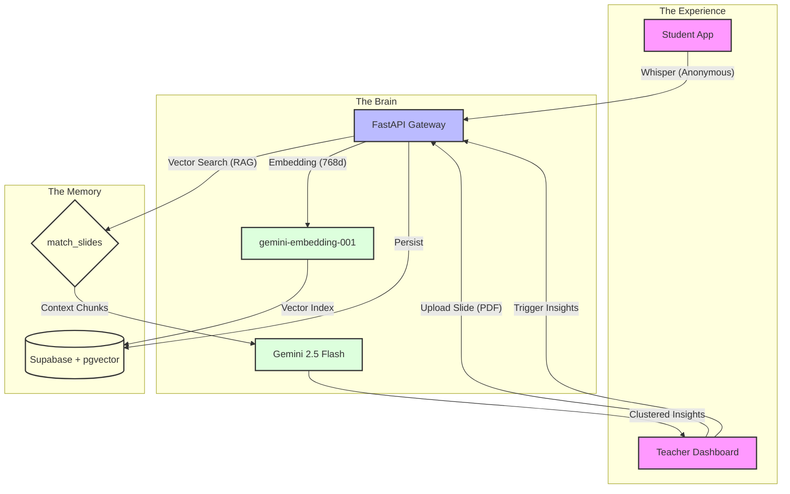

# 🤫 WhisperHunt AI v1.2
### *Bridging the Silence in the Classroom with RAG & Gemini 2.5 Flash*

[](https://nextjs.org/)
[](https://www.typescriptlang.org/)
[](https://fastapi.tiangolo.com/)
[](https://deepmind.google/technologies/gemini/)
[-3ECF8E?style=for-the-badge&logo=supabase)](https://supabase.com/)
[](https://opensource.org/licenses/MIT)

**WhisperHunt AI** transforms passive classrooms into data-driven learning environments. By leveraging **Retrieval-Augmented Generation (RAG)**, it captures anonymous student feedback, maps it to specific lecture slides via vector search, and delivers high-impact "Insight Clusters" to teachers in real-time.

---

## 📑 Table of Contents
1. [What's New in v1.2](#-whats-new-in-v12)
2. [Core Pillars](#-core-pillars)
3. [Technical Architecture](#-technical-architecture)
4. [Experience Walkthrough](#-experience-walkthrough)
5. [Tech Stack](#-tech-stack)
6. [Deployment & Local Setup](#-deployment--local-setup)
7. [Team & Credits](#-team--credits)

---

## 🚀 What's New in v1.2
- **Enhanced Teacher Dashboard:** Beautiful new glassmorphism interface with time-based greetings, active class stats cards, and redesigned grid layouts.
- **Smart QR Code Sharing:** Upgraded modal allows teachers to instantly copy the join link alongside the QR code with smooth entrance animations.
- **Next.js 16 & Tailwind CSS 4:** Bleeding-edge frontend performance and styling.
- **Gemini 2.5 Flash Integration:** Faster, more accurate semantic clustering and re-explanation strategies.
- **Quick React (🥺):** One-tap signaling for instant "I'm lost" feedback.
- **AI Insight Board:** Live dashboard with priority heatmaps and slide-mapped confusion clusters.

---

## ✨ Core Pillars

| 🛡️ Radical Anonymity | 🧠 Semantic Intelligence | ⚡ Real-Time Pulse |
| :--- | :--- | :--- |
| Students speak freely without fear of judgment. No login required. | AI doesn't just list questions; it understands *why* they are confused. | Live dashboards that update every 5 seconds to catch confusion as it happens. |

---

## 🏗️ Technical Architecture

The engine behind WhisperHunt combines **Semantic Search** with **Generative Refinement**.



---

## 📽️ Experience Walkthrough

### 🎓 Student Experience (`/student/[classId]`)
*Minimalist, mobile-first interface designed for zero friction.*

- **One-Tap Confusion:** The `🥺 จารย์งงจัง!` button sends an instant signal.
- **Detailed Whispers:** Type specific questions anonymously.
- **Real-time Feedback:** Tactile UI responses with toast notifications (ส่งให้ครูแล้วจ้า 🚀).

### 🧑‍🏫 Teacher Dashboard (`/teacher/class/[classId]`)
*Mission-control for educators with automated slide-to-question mapping.*

- **Knowledge Injection (PDF RAG):** Upload lecture PDFs. System performs OCR and vectorizes content page-by-page (768-dimension vectors).
- **AI Insight Board:** 
    - **Clustered Issues:** AI groups similar student questions into logical "Issue Clusters".
    - **Slide Mapping:** Automatically identifies which slide corresponds to the confusion.
    - **Actionable Suggestions:** Provides specific strategies to re-explain the concept (Analogies, Check-up Questions, Socratic Guides).
- **Live Stats:** Monitor total signals and urgent issues in real-time.
- **Instant Sharing:** Share the class instantly via the newly enhanced quick-copy URL and QR Code modal.

---

## 🛠️ Tech Stack

*   **Frontend:** Next.js 16 (App Router), React 19, Tailwind CSS 4, Lucide Icons.
*   **Backend:** FastAPI (Python 3), PyPDF2 for OCR/Extraction.
*   **AI Engine:** 
    *   `Gemini 2.5 Flash`: High-speed semantic clustering & reasoning.
    *   `gemini-embedding-001`: Professional-grade 768d vector embeddings.
*   **Data Layer:** Supabase (PostgreSQL) with `pgvector` for similarity calculations and custom SQL RPC for RAG retrieval.

---

## 🚀 Deployment & Local Setup

### 1. Environment Variables
Add these to `backend/.env`:
```bash
GOOGLE_API_KEY=your_key
SUPABASE_URL=your_url
SUPABASE_KEY=your_key
```

Add these to `.env.local` (Frontend):
```bash
NEXT_PUBLIC_SUPABASE_URL=your_url
NEXT_PUBLIC_SUPABASE_ANON_KEY=your_key
NEXT_PUBLIC_API_URL=http://127.0.0.1:8000
```

### 2. Database Sync
Apply `setupdata.sql` in the Supabase SQL Editor to:
1. Enable `pgvector`.
2. Create `classes`, `slides`, `questions`, and `clusters` tables.
3. Deploy the `match_slides` RAG function.

### 3. Run Locally
```bash
# Terminal 1: Backend
cd backend && pip install -r requirements.txt
uvicorn ai:app --reload

# Terminal 2: Frontend
npm install && npm run dev
```

---

## 🏆 Team & Credits

*Developed for **OTTC Hackathon 2026** · Focused on Pedagogy and AI Excellence.*

Built by the WhisperHunt Team. Leveraging the incredible power of Google's Gemini Models to solve real-world educational friction points.

